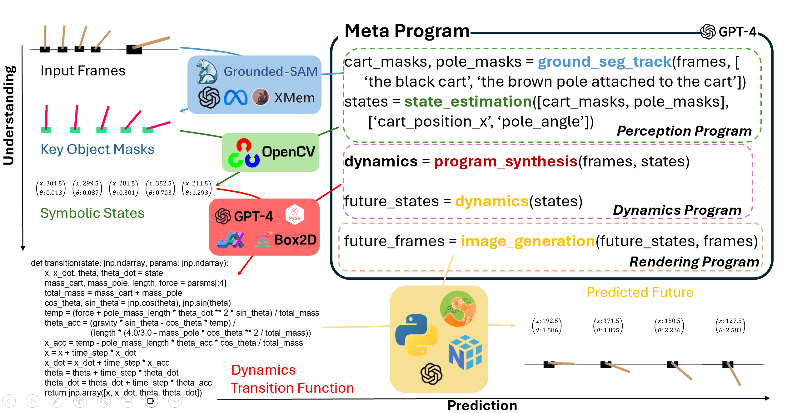

# ProgGen (ICLR-World Models Workshop 2025)

This repository contains the implementation of the paper:
> **Programmatic Video Prediction Using Large Language Models"**<br>
> [Hao Tang](https://haotang1995.github.io/), [Kevin Ellis](https://www.cs.cornell.edu/~ellisk/), [Suhas Lohit](https://www.merl.com/people/slohit), [Michael J. Jones](https://www.merl.com/people/mjones), [Moitreya Chatterjee](https://sites.google.com/site/metrosmiles/)

International Conference on Learning Representations (**ICLR**) Workshops, 2025


## [Website](https://github.com/metro-smiles/ProgGen) |  [Paper]() 

## Summary

The task of estimating the world model describing the dynamics of a real world process assumes immense importance for anticipating and preparing for future outcomes and finds wide-spread use in applications such as video surveillance, robotics applications, autonomous driving, etc. This task entails synthesizing plausible visual futures, given a few frames of a video - necessary to set the visual context for the synthesis. Towards this end, we propose ProgGen - which undertakes the task of video frame prediction by synthesizing computer programs which represent the dynamics of the video using a set of neuro-symbolic, human-interpretable set of states (one per frame) by leveraging the inductive biases of Large (Vision) Language Models (LLM/VLM). In particular, ProgGen utilizes LLM/VLM to synthesize computer programs to: (i) estimate the states of the video, given the visual context (i.e. the frames); (ii) predict the states corresponding to future time steps by estimating the transition dynamics; (iii) render the predicted states as visual RGB-frames. Empirical evaluations reveal that our proposed method outperforms competing techniques at the task of video frame prediction in two challenging environments: (i) PhyWorld and (ii) Cart Pole. Additionally, ProgGen permits counter-factual reasoning and editability attesting to its effectiveness and generalizability.




## Table of contents
-----
  * [Installation](#Installation)
  * [Setup](#Setup)
  * [Execution](#Execution)
  * [Citation](#Citation)
------


# Installation

In order to install the requisite libraries, please run the following:
```
$ sh Install.sh
```

# Setup

Download the dataset in hdf5 format from this [link](https://huggingface.co/datasets/magicr/phyworld) and place it under: ./proggen/data/downloaded_datasets/

# Execution

In order to run the code, please run the following command from the root folder:
```
$ python learn_cont_param.py
```


## Citation

```
@inproceedings{tang2025programmatic,
  title={Programmatic Video Prediction Using Large Language Models},
  author={Tang, Hao and Ellis, Kevin and Lohit, Suhas and Jones, Michael J and Chatterjee, Moitreya},
  booktitle={ICLR 2025 Workshop on World Models: Understanding, Modelling and Scaling}
}
```

